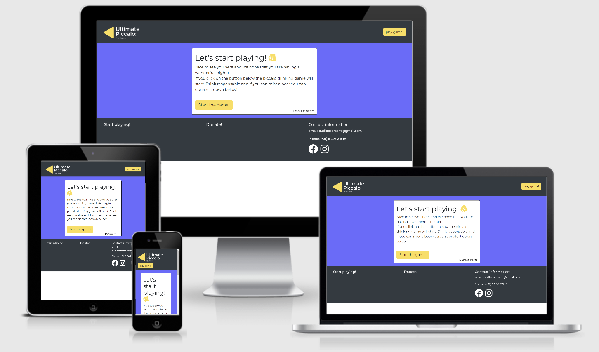
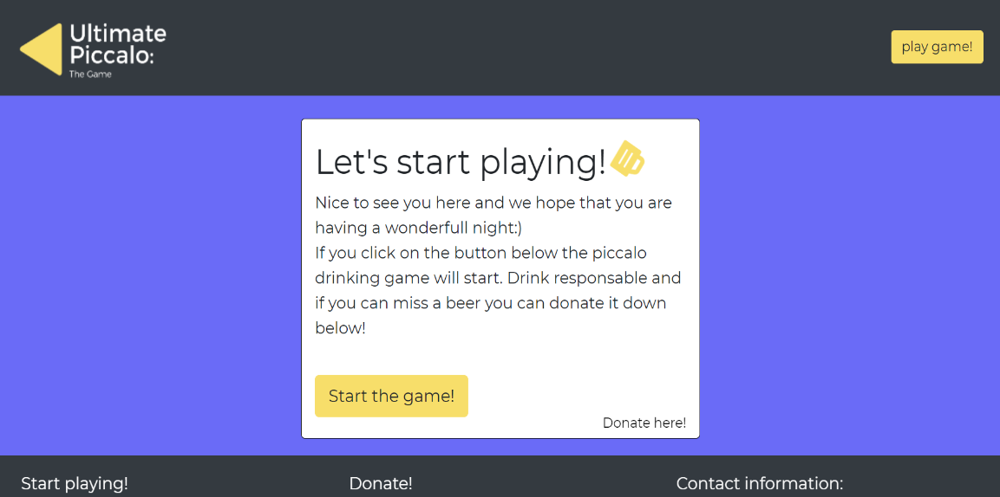
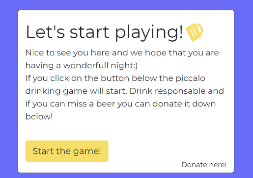
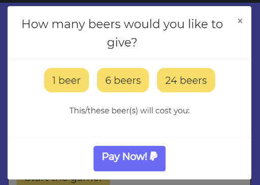
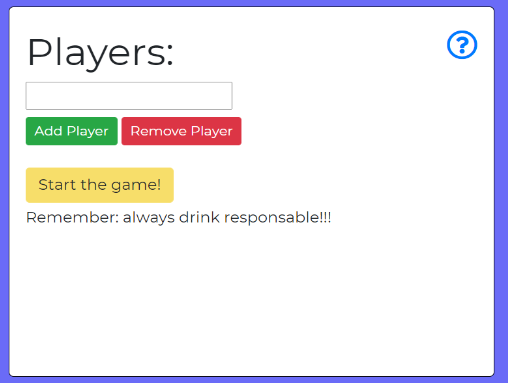
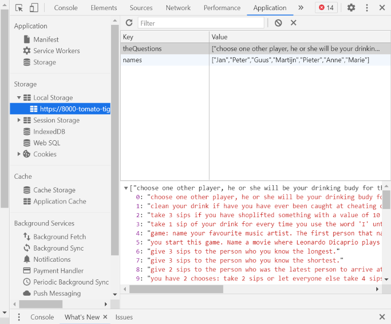
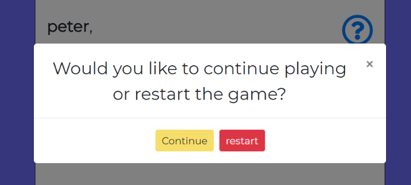

## Table of Contents

-   **[Description](#description)**
-   **[Deployment and Live Demo](#deployment-and-live-demo)**
    -   [Download](#download)
    -   [Clone with Git](#clone-with-git)
    -   [Live Demo](#live-demo)
-   **[UX](#ux)**
    -   [User Stories](#user-stories)
    -   [Wireframes](#wireframes)
    -   [Design](#design)
-   **[Features](#features)**
    -   [Diffent Sections](#different-sections)
    -   [Save Function](#save-function)
    -   [Add and delete players function](#add-and-delete-players-function)
    -   [Reset Game](#reset-game)
    -   [Responsive Design](#responsive-design)
-   **[Technologies](#technologies)**
-   **[Tools](#tools)**
-   **[Testing](#testing)**
    -   [Manual Testing](#manual-testing)
    -   [User Testing](#user-testing)
-   **[Upcoming Features](#upcoming-features)**
-   **[Acknowledgments](#acknowledgments)**

---

## Description

"Ultimate Piccalo: The Game" is a drinking game that friends and/or family can use when they want to have a lovely night. The game asks for the names of the people who want to play and it then give these players randomly a question or task he or she has to compleet. These questions involve drinking so remember to drink responsible! Next to the game there is also an option to donate to the creator in the form of beers.

---

## Deployment and Live Demo

The game can be used locally by cloning or downloading the repository from [github](https://github.com/waterrot/Ultimate-Piccolo-The-Game).

### Download

1. Click on "Clone or download" under the repository name.

2. Click on "Download ZIP"

3. Choose directory to download it to and unzip file

4. Access the CV-builder-master folder

5. Open index.html into your browser to open the CV Builder

### Clone with Git

In your local IDE:

1. Open a new terminal window

2. Change the current working directory to the location where the cloned directory to be created.

3. Enter the following line in the console:

    `git clone https://github.com/waterrot/Ultimate-Piccolo-The-Game`

4. Press enter

### Live Demo

The live demo of the cv builder has been deployed to Github Pages and is accessible [here](https://waterrot.github.io/Ultimate-Piccolo-The-Game/).

---

## UX

### User Stories

_Generic User / Player_

-   I want to play a game with my friends.
-   I want to be able to donate money to the creator.
-   I want to email the creator if I have any questions.
-   I want to reset a game when I am playing one.
-   I want to add players to the game.
-   I want to delete players from the game.
-   I want to close the game and later open it when I open the browser again.

These goals are accomplished in the following way:

-   The game can be played when the player gives the names to the game and presses enter.
-   Players can donate money through a modal which links to Paypal.
-   In the footer of the site the email addresse of the creator is visible so people can get in touch.
-   When the players are playing a game the reset button will be visible under in the screen.
-   when the player is on the "add players" screen there is an option to add and delete players using a button. 
-   All the data is stored in local storage so when a player refreshes the page the game won't be

### Wireframes

The wireframe was made by hand. The final version of the wireframes can be found [here](assets/images/readme/wireframe.png)

### Design
When the game was made the design was focussed on mobile first. down below you can find the 3 main design challenges: 

#### Fonts
I used [Google Fonts](https://fonts.google.com/) to select a font type. I looked for a font with a lot of rounding who was nice to look at. 
I ended up using Montserrat because it is easy to read and matches the roundings of the card in which the text is displayed.

#### colors
The yellow color (#F7DE6A) was manually selected because it is the color of beer and then the oppesite color (the blue/purple color #F7DE6A) was selected with the help of [Adobe Color Wheel](https://color.adobe.com/nl/create/color-wheel).
In the picure below you can see the home screen with the 2 main colors:

#### Logo
The logo was made with help of [Canva](https://canva.com). I used a simplistic elements simplic and the same font I used on the site. 
I reason why I chose to make it simple is to show off some peace and make it nice to look at. 

---

## Features

### different Sections

The website can be divided into four main sections:

-   **Welcome Section** This section is a card designed section where people read about the game and continue to another page.
    
-   **Donate Section** This section is creates a possibility so that people can donate to the creator.
    
-   **Players Section** Here players can be added and deleted. and there is an information modal on this section.
    
-   **Game Section** there the randomly selected name and the randomly selected question will be displayed.
    

Sections are responsive and have dynamic element with them. 

### Save Function

The game make use of the local storage so it is not a problem when players refresh the page.
The names that where filled in by the players are stored in an array in the local storage and are randomly selected when you click on the screen.
The questions and card are also stored in an array in the local storage. Every time the player clicks on the screen a random other item from the array will be selected and the old one will be deleted from local storage.
Any changes made to the CV or its theme can be saved to be updated at a later time.
In the picture down below you can see the local storage with the 2 saved arrays:

### Add and delete players function

In the players section there are 2 buttons to add and delete players. The add button is made with the help of a "for loop" and the delete button deletes the newest input field. 
In the picture down below you can see the 2 buttons, the "add player" and "remove player" buttons:

### Reset Game

The reset button on in the game section deletes the local storage and refreshes the page. before this is done the player will be asked if he or she want to continue with it.
When the page is refeshed the player will get the same question if he or she would like to continue the game or start a new one. On the picture below you can see this notification in the modal.

### Responsive Design

This application is build mobile first because it will mostly be used on small gatherings where most people do not have a laptop with them.
With the help of Bootstrap the screens on different screen sizes could easily be editted. The website is customized for all screen sizes with some help to the Google Chrome's dev tools bugs could easily be fixed.

---

## Technologies

-   HTML
-   CSS
-   JavaScript
-   [JQuery](https://jquery.com/)
-   [Bootstrap](https://getbootstrap.com/)
---

## Tools

-   Pen and paper to create the wireframe
-   [Canva](https://canva.com) to create the logo
-   [Font Awesome](https://fontawesome.com/): used for all icons throughout the site
-   [Google Fonts](https://fonts.google.com/): All the fonts were imported from Google Fonts
-   [ResponsiveDesign.is](http://ami.responsivedesign.is/): used to make a photo of how the website will look in different screen sizes.
---

## Testing

### Manual Testing

When the user get the home page he/she can read the first card that comes on the screen. The text that is shown to the user is an intro to the game.
The user also gets the choose to go either to the game page of donate something to the creator. 

When the user chooses for donating to the creator a modal will pop up. This modal asks the user if he or she wants to donate 1, 6 or 24 beer(s). 
When the user presses the button with the amout of beers he or she want to donate the play now button will go to Paypal with that amout preset.

When the user chooses to go to the game page they will first see the "players section" if it is their first visit. Here they can fill in the player names.
They can easily add and remove player names by pressing the "add player" or "remove player" button. If it is not clear to the user he or she can also click on the question mark icon.
A modal will come up with an explanation on how the game works and how that specific section works. When the user presses the "start the game!" button the game will start.

The user then will see a screen with first one randomly selected player from the players who manually where put into the website and then a randomly selected question/task he or she has to complete.
By pressing on the card the next question and player will randomly be selected. There is also a reset button in the right down corner if the user would like to reset the game. A modal will then pop up with 
the question if the user is sure about resetting the game. There is also another question mark icon in the top right corner that triggers a modal with how to play the game. 

### User Testing

The website is fully working and users with no technical knowage can easily test it. I asked 3 friends if anything was unclear to them when they used the site.
This resulted in the following changes:

-   Added a reset button to make the user experience better
-   Added information modals to the game to answer all the main questions
-   changed the home page to be more focussed on the game and not on donating
-   When the page refreshes the user will get a question if he or she would like to continue

## Upcoming features

A number of new features will be implemented in the future.

-   Multible packages of questions so an user can select a question pack based on a theme. 

-   A form where users can upload their own questions to us so that we could add it to one of the packages.

-   A Function where people can make their own question packs with their own questions and pre made questions.

-   Make it possible to delete a specific player instead of only the last one entered.

---

## Acknowledgments

Thanks to [Felipe Alarcon](https://github.com/felipe-alarcon) for helping me with brainstorming on how to code curtain things and for helping me reflect on my own work.

[The following Code Institute student project](https://github.com/jumboduck/CV-Builder) helped me in to create this readme file.

Thanks [Slack Overflow](https://stackoverflow.com/) for giving me code idea's when I was not curtain on how to code something.

Thanks [Code Pen IO](https://codepen.io/rsherry/pen/QwoqyO) for giving me tips on how to make the add and remove players Javascript code.

The footer was made with help of a previous project about making a [CV](https://github.com/waterrot/CV).